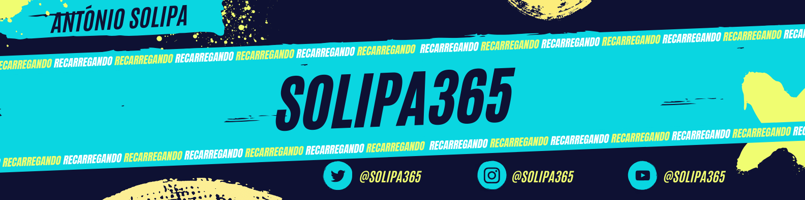

 

<h1 align="center"> < 🌎 Hello World!, Meu nome é <strong>António Solipa</strong>  /> </h1> 

 
🌱 Natrural de Fundão, Portugal 📍 19 anos & futuro <strong>👨🏼‍💻 Dev Full Stack</strong>.

Sou Chief  Executive Officer (CEO) da ArtLife Innovation e fundador das startups TecnoDev e CodeCraft.  
Sou um profissional dedicado, proativo e empenhado em desenvolver minhas habilidades na área de Desenvolvimento Full Stack, com muito interesse nas áreas de Front-end, Web e UI Design.

Estudo na Escola Profissional do Fundão, focado em Programação e Comunicação, e estou sempre em busca de aprendizado e aprimoramento para alcançar resultados positivos e contribuir para o sucesso da equipe e da organização em que atuo. 

Estou constantemente à procura de novos desafios e oportunidades para aprender e crescer, então...  
Se estiveres interessado em colaborar ou compartilhar ideias, não hesites em entrar em contato comigo! 😉

    
    
     
     
    
    
    
     
    

 

 

    
    

 

  Feito com amor por <a href="https://www.solipa365.com/" target="_blank" style="color: #8FE2D9">@solipa365</a>. 🩵  
  

